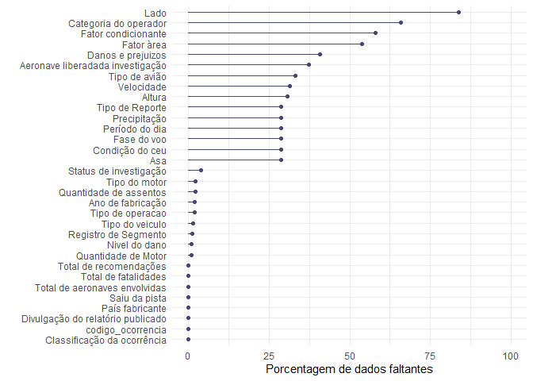

Ocorrências Aeronáuticas na Aviação Civil Brasileira
================
Joziani Mota Vieira

<div style="width: 100% text-align: justify">

## Apresentação

Exploração da base dados “Ocorrências Aeronáuticas na Aviação Civil
Brasileira”, utilizando dados abertos do governo, disponíveis em:
(<https://dados.gov.br/dataset/ocorrencias-aeronauticas-da-aviacao-civil-brasileira>).

</div>

## Explicação do processo utilizado

Inicialmente foi feita a junção das bases de dados aeronave,
fator\_contribuinte, ocorrencia e reportes\_2011\_2019, selecionando e
manipulando variáveis que, aparentemente, eram interessantes para as
análises. As bases que não foram incluídas, não tinham variáveis de
interesse.

Após foi feita análise descritiva e análise de dados faltantes das
variáveis. Assim através dessas análises foram selecionadas,
inicialmente, algumas variáveis para criação do *Modelo de Poisson*,
foram selecionadas variáveis com até 30% de dados faltantes. Ainda,
foram verificadas as variáveis que tinham preditores com variância zero
e combinações lineares.

Para os modelos foram selecionados apenas fatalidade maiores que 0, já
que a quantidade de ocorrências sem fatalidades tinha quantidade muito
maior, o que não deixava o modelo convergir. Foi feito um modelo inicial
com as variáveis selecionada, e através desse modelo foi verificado
variáveis que são linearmente dependentes e aplicado o método
steepwase, para seleção de variáveis para entrar no modelo final.

## Análise descritiva

### Variáveis categóricas

``` r
tab_cat
```

<!--html_preserve-->

<style>html {
  font-family: -apple-system, BlinkMacSystemFont, 'Segoe UI', Roboto, Oxygen, Ubuntu, Cantarell, 'Helvetica Neue', 'Fira Sans', 'Droid Sans', Arial, sans-serif;
}

#kmetpeqmnx .gt_table {
  display: table;
  border-collapse: collapse;
  margin-left: auto;
  margin-right: auto;
  color: #333333;
  font-size: 16px;
  font-weight: normal;
  font-style: normal;
  background-color: #FFFFFF;
  width: auto;
  border-top-style: solid;
  border-top-width: 2px;
  border-top-color: #A8A8A8;
  border-right-style: none;
  border-right-width: 2px;
  border-right-color: #D3D3D3;
  border-bottom-style: solid;
  border-bottom-width: 2px;
  border-bottom-color: #A8A8A8;
  border-left-style: none;
  border-left-width: 2px;
  border-left-color: #D3D3D3;
}

#kmetpeqmnx .gt_heading {
  background-color: #FFFFFF;
  text-align: center;
  border-bottom-color: #FFFFFF;
  border-left-style: none;
  border-left-width: 1px;
  border-left-color: #D3D3D3;
  border-right-style: none;
  border-right-width: 1px;
  border-right-color: #D3D3D3;
}

#kmetpeqmnx .gt_title {
  color: #333333;
  font-size: 125%;
  font-weight: initial;
  padding-top: 4px;
  padding-bottom: 4px;
  border-bottom-color: #FFFFFF;
  border-bottom-width: 0;
}

#kmetpeqmnx .gt_subtitle {
  color: #333333;
  font-size: 85%;
  font-weight: initial;
  padding-top: 0;
  padding-bottom: 4px;
  border-top-color: #FFFFFF;
  border-top-width: 0;
}

#kmetpeqmnx .gt_bottom_border {
  border-bottom-style: solid;
  border-bottom-width: 2px;
  border-bottom-color: #D3D3D3;
}

#kmetpeqmnx .gt_col_headings {
  border-top-style: solid;
  border-top-width: 2px;
  border-top-color: #D3D3D3;
  border-bottom-style: solid;
  border-bottom-width: 2px;
  border-bottom-color: #D3D3D3;
  border-left-style: none;
  border-left-width: 1px;
  border-left-color: #D3D3D3;
  border-right-style: none;
  border-right-width: 1px;
  border-right-color: #D3D3D3;
}

#kmetpeqmnx .gt_col_heading {
  color: #333333;
  background-color: #FFFFFF;
  font-size: 100%;
  font-weight: normal;
  text-transform: inherit;
  border-left-style: none;
  border-left-width: 1px;
  border-left-color: #D3D3D3;
  border-right-style: none;
  border-right-width: 1px;
  border-right-color: #D3D3D3;
  vertical-align: bottom;
  padding-top: 5px;
  padding-bottom: 6px;
  padding-left: 5px;
  padding-right: 5px;
  overflow-x: hidden;
}

#kmetpeqmnx .gt_column_spanner_outer {
  color: #333333;
  background-color: #FFFFFF;
  font-size: 100%;
  font-weight: normal;
  text-transform: inherit;
  padding-top: 0;
  padding-bottom: 0;
  padding-left: 4px;
  padding-right: 4px;
}

#kmetpeqmnx .gt_column_spanner_outer:first-child {
  padding-left: 0;
}

#kmetpeqmnx .gt_column_spanner_outer:last-child {
  padding-right: 0;
}

#kmetpeqmnx .gt_column_spanner {
  border-bottom-style: solid;
  border-bottom-width: 2px;
  border-bottom-color: #D3D3D3;
  vertical-align: bottom;
  padding-top: 5px;
  padding-bottom: 6px;
  overflow-x: hidden;
  display: inline-block;
  width: 100%;
}

#kmetpeqmnx .gt_group_heading {
  padding: 8px;
  color: #333333;
  background-color: #FFFFFF;
  font-size: 100%;
  font-weight: initial;
  text-transform: inherit;
  border-top-style: solid;
  border-top-width: 2px;
  border-top-color: #D3D3D3;
  border-bottom-style: solid;
  border-bottom-width: 2px;
  border-bottom-color: #D3D3D3;
  border-left-style: none;
  border-left-width: 1px;
  border-left-color: #D3D3D3;
  border-right-style: none;
  border-right-width: 1px;
  border-right-color: #D3D3D3;
  vertical-align: middle;
}

#kmetpeqmnx .gt_empty_group_heading {
  padding: 0.5px;
  color: #333333;
  background-color: #FFFFFF;
  font-size: 100%;
  font-weight: initial;
  border-top-style: solid;
  border-top-width: 2px;
  border-top-color: #D3D3D3;
  border-bottom-style: solid;
  border-bottom-width: 2px;
  border-bottom-color: #D3D3D3;
  vertical-align: middle;
}

#kmetpeqmnx .gt_from_md > :first-child {
  margin-top: 0;
}

#kmetpeqmnx .gt_from_md > :last-child {
  margin-bottom: 0;
}

#kmetpeqmnx .gt_row {
  padding-top: 8px;
  padding-bottom: 8px;
  padding-left: 5px;
  padding-right: 5px;
  margin: 10px;
  border-top-style: solid;
  border-top-width: 1px;
  border-top-color: #D3D3D3;
  border-left-style: none;
  border-left-width: 1px;
  border-left-color: #D3D3D3;
  border-right-style: none;
  border-right-width: 1px;
  border-right-color: #D3D3D3;
  vertical-align: middle;
  overflow-x: hidden;
}

#kmetpeqmnx .gt_stub {
  color: #333333;
  background-color: #FFFFFF;
  font-size: 100%;
  font-weight: initial;
  text-transform: inherit;
  border-right-style: solid;
  border-right-width: 2px;
  border-right-color: #D3D3D3;
  padding-left: 12px;
}

#kmetpeqmnx .gt_summary_row {
  color: #333333;
  background-color: #FFFFFF;
  text-transform: inherit;
  padding-top: 8px;
  padding-bottom: 8px;
  padding-left: 5px;
  padding-right: 5px;
}

#kmetpeqmnx .gt_first_summary_row {
  padding-top: 8px;
  padding-bottom: 8px;
  padding-left: 5px;
  padding-right: 5px;
  border-top-style: solid;
  border-top-width: 2px;
  border-top-color: #D3D3D3;
}

#kmetpeqmnx .gt_grand_summary_row {
  color: #333333;
  background-color: #FFFFFF;
  text-transform: inherit;
  padding-top: 8px;
  padding-bottom: 8px;
  padding-left: 5px;
  padding-right: 5px;
}

#kmetpeqmnx .gt_first_grand_summary_row {
  padding-top: 8px;
  padding-bottom: 8px;
  padding-left: 5px;
  padding-right: 5px;
  border-top-style: double;
  border-top-width: 6px;
  border-top-color: #D3D3D3;
}

#kmetpeqmnx .gt_striped {
  background-color: rgba(128, 128, 128, 0.05);
}

#kmetpeqmnx .gt_table_body {
  border-top-style: solid;
  border-top-width: 2px;
  border-top-color: #D3D3D3;
  border-bottom-style: solid;
  border-bottom-width: 2px;
  border-bottom-color: #D3D3D3;
}

#kmetpeqmnx .gt_footnotes {
  color: #333333;
  background-color: #FFFFFF;
  border-bottom-style: none;
  border-bottom-width: 2px;
  border-bottom-color: #D3D3D3;
  border-left-style: none;
  border-left-width: 2px;
  border-left-color: #D3D3D3;
  border-right-style: none;
  border-right-width: 2px;
  border-right-color: #D3D3D3;
}

#kmetpeqmnx .gt_footnote {
  margin: 0px;
  font-size: 90%;
  padding: 4px;
}

#kmetpeqmnx .gt_sourcenotes {
  color: #333333;
  background-color: #FFFFFF;
  border-bottom-style: none;
  border-bottom-width: 2px;
  border-bottom-color: #D3D3D3;
  border-left-style: none;
  border-left-width: 2px;
  border-left-color: #D3D3D3;
  border-right-style: none;
  border-right-width: 2px;
  border-right-color: #D3D3D3;
}

#kmetpeqmnx .gt_sourcenote {
  font-size: 90%;
  padding: 4px;
}

#kmetpeqmnx .gt_left {
  text-align: left;
}

#kmetpeqmnx .gt_center {
  text-align: center;
}

#kmetpeqmnx .gt_right {
  text-align: right;
  font-variant-numeric: tabular-nums;
}

#kmetpeqmnx .gt_font_normal {
  font-weight: normal;
}

#kmetpeqmnx .gt_font_bold {
  font-weight: bold;
}

#kmetpeqmnx .gt_font_italic {
  font-style: italic;
}

#kmetpeqmnx .gt_super {
  font-size: 65%;
}

#kmetpeqmnx .gt_footnote_marks {
  font-style: italic;
  font-size: 65%;
}
</style>

<div id="kmetpeqmnx" style="overflow-x:auto;overflow-y:auto;width:auto;height:auto;">

<table class="gt_table">

<thead class="gt_col_headings">

<tr>

<th class="gt_col_heading gt_columns_bottom_border gt_left" rowspan="1" colspan="1">

<strong>Variáveis</strong>

</th>

<th class="gt_col_heading gt_columns_bottom_border gt_center" rowspan="1" colspan="1">

<strong>N = 8 911</strong>

</th>

</tr>

</thead>

<tbody class="gt_table_body">

<tr>

<td class="gt_row gt_left" style="font-weight: bold;">

Categoria do operador

</td>

<td class="gt_row gt_center">

</td>

</tr>

<tr>

<td class="gt_row gt_left" style="text-align: left; text-indent: 10px;">

PARTICULAR

</td>

<td class="gt_row gt_center">

733 (24%)

</td>

</tr>

<tr>

<td class="gt_row gt_left" style="text-align: left; text-indent: 10px;">

REGULAR

</td>

<td class="gt_row gt_center">

890 (29%)

</td>

</tr>

<tr>

<td class="gt_row gt_left" style="text-align: left; text-indent: 10px;">

Outros

</td>

<td class="gt_row gt_center">

1 425 (47%)

</td>

</tr>

<tr>

<td class="gt_row gt_left" style="font-weight: bold;">

Tipo do veiculo

</td>

<td class="gt_row gt_center">

</td>

</tr>

<tr>

<td class="gt_row gt_left" style="text-align: left; text-indent: 10px;">

AVIÃO

</td>

<td class="gt_row gt_center">

7 088 (81%)

</td>

</tr>

<tr>

<td class="gt_row gt_left" style="text-align: left; text-indent: 10px;">

HELICÓPTERO

</td>

<td class="gt_row gt_center">

1 269 (14%)

</td>

</tr>

<tr>

<td class="gt_row gt_left" style="text-align: left; text-indent: 10px;">

Outros

</td>

<td class="gt_row gt_center">

427 (4,9%)

</td>

</tr>

<tr>

<td class="gt_row gt_left" style="font-weight: bold;">

Tipo do motor

</td>

<td class="gt_row gt_center">

</td>

</tr>

<tr>

<td class="gt_row gt_left" style="text-align: left; text-indent: 10px;">

JATO

</td>

<td class="gt_row gt_center">

1 376 (16%)

</td>

</tr>

<tr>

<td class="gt_row gt_left" style="text-align: left; text-indent: 10px;">

PISTÃO

</td>

<td class="gt_row gt_center">

5 239 (60%)

</td>

</tr>

<tr>

<td class="gt_row gt_left" style="text-align: left; text-indent: 10px;">

SEM TRAÇÃO

</td>

<td class="gt_row gt_center">

46 (0,5%)

</td>

</tr>

<tr>

<td class="gt_row gt_left" style="text-align: left; text-indent: 10px;">

TURBOEIXO

</td>

<td class="gt_row gt_center">

958 (11%)

</td>

</tr>

<tr>

<td class="gt_row gt_left" style="text-align: left; text-indent: 10px;">

TURBOÉLICE

</td>

<td class="gt_row gt_center">

1 103 (13%)

</td>

</tr>

<tr>

<td class="gt_row gt_left" style="font-weight: bold;">

Quantidade de Motor

</td>

<td class="gt_row gt_center">

</td>

</tr>

<tr>

<td class="gt_row gt_left" style="text-align: left; text-indent: 10px;">

BIMOTOR

</td>

<td class="gt_row gt_center">

3 537 (40%)

</td>

</tr>

<tr>

<td class="gt_row gt_left" style="text-align: left; text-indent: 10px;">

MONOMOTOR

</td>

<td class="gt_row gt_center">

5 044 (57%)

</td>

</tr>

<tr>

<td class="gt_row gt_left" style="text-align: left; text-indent: 10px;">

Outros

</td>

<td class="gt_row gt_center">

251 (2,8%)

</td>

</tr>

<tr>

<td class="gt_row gt_left" style="font-weight: bold;">

País fabricante

</td>

<td class="gt_row gt_center">

</td>

</tr>

<tr>

<td class="gt_row gt_left" style="text-align: left; text-indent: 10px;">

BRASIL

</td>

<td class="gt_row gt_center">

8 770 (98%)

</td>

</tr>

<tr>

<td class="gt_row gt_left" style="text-align: left; text-indent: 10px;">

Outros

</td>

<td class="gt_row gt_center">

141 (1,6%)

</td>

</tr>

<tr>

<td class="gt_row gt_left" style="font-weight: bold;">

Registro de Segmento

</td>

<td class="gt_row gt_center">

</td>

</tr>

<tr>

<td class="gt_row gt_left" style="text-align: left; text-indent: 10px;">

INSTRUÇÃO

</td>

<td class="gt_row gt_center">

1 399 (16%)

</td>

</tr>

<tr>

<td class="gt_row gt_left" style="text-align: left; text-indent: 10px;">

PARTICULAR

</td>

<td class="gt_row gt_center">

2 958 (34%)

</td>

</tr>

<tr>

<td class="gt_row gt_left" style="text-align: left; text-indent: 10px;">

REGULAR

</td>

<td class="gt_row gt_center">

1 333 (15%)

</td>

</tr>

<tr>

<td class="gt_row gt_left" style="text-align: left; text-indent: 10px;">

TÁXI AÉREO

</td>

<td class="gt_row gt_center">

1 241 (14%)

</td>

</tr>

<tr>

<td class="gt_row gt_left" style="text-align: left; text-indent: 10px;">

Outros

</td>

<td class="gt_row gt_center">

1 868 (21%)

</td>

</tr>

<tr>

<td class="gt_row gt_left" style="font-weight: bold;">

Tipo de operacao

</td>

<td class="gt_row gt_center">

</td>

</tr>

<tr>

<td class="gt_row gt_left" style="text-align: left; text-indent: 10px;">

INSTRUÇÃO

</td>

<td class="gt_row gt_center">

1 350 (15%)

</td>

</tr>

<tr>

<td class="gt_row gt_left" style="text-align: left; text-indent: 10px;">

PRIVADA

</td>

<td class="gt_row gt_center">

3 021 (35%)

</td>

</tr>

<tr>

<td class="gt_row gt_left" style="text-align: left; text-indent: 10px;">

REGULAR

</td>

<td class="gt_row gt_center">

1 337 (15%)

</td>

</tr>

<tr>

<td class="gt_row gt_left" style="text-align: left; text-indent: 10px;">

TÁXI AÉREO

</td>

<td class="gt_row gt_center">

1 219 (14%)

</td>

</tr>

<tr>

<td class="gt_row gt_left" style="text-align: left; text-indent: 10px;">

Outros

</td>

<td class="gt_row gt_center">

1 811 (21%)

</td>

</tr>

<tr>

<td class="gt_row gt_left" style="font-weight: bold;">

Nivel do dano

</td>

<td class="gt_row gt_center">

</td>

</tr>

<tr>

<td class="gt_row gt_left" style="text-align: left; text-indent: 10px;">

DESTRUÍDA

</td>

<td class="gt_row gt_center">

1 131 (13%)

</td>

</tr>

<tr>

<td class="gt_row gt_left" style="text-align: left; text-indent: 10px;">

LEVE

</td>

<td class="gt_row gt_center">

2 063 (23%)

</td>

</tr>

<tr>

<td class="gt_row gt_left" style="text-align: left; text-indent: 10px;">

NENHUM

</td>

<td class="gt_row gt_center">

2 282 (26%)

</td>

</tr>

<tr>

<td class="gt_row gt_left" style="text-align: left; text-indent: 10px;">

SUBSTANCIAL

</td>

<td class="gt_row gt_center">

3 354 (38%)

</td>

</tr>

<tr>

<td class="gt_row gt_left" style="font-weight: bold;">

Fator condicionante

</td>

<td class="gt_row gt_center">

</td>

</tr>

<tr>

<td class="gt_row gt_left" style="text-align: left; text-indent: 10px;">

INDIVIDUAL

</td>

<td class="gt_row gt_center">

736 (20%)

</td>

</tr>

<tr>

<td class="gt_row gt_left" style="text-align: left; text-indent: 10px;">

OPERAÇÃO DA AERONAVE

</td>

<td class="gt_row gt_center">

2 246 (60%)

</td>

</tr>

<tr>

<td class="gt_row gt_left" style="text-align: left; text-indent: 10px;">

Outros

</td>

<td class="gt_row gt_center">

766 (20%)

</td>

</tr>

<tr>

<td class="gt_row gt_left" style="font-weight: bold;">

Fator àrea

</td>

<td class="gt_row gt_center">

</td>

</tr>

<tr>

<td class="gt_row gt_left" style="text-align: left; text-indent: 10px;">

FATOR HUMANO

</td>

<td class="gt_row gt_center">

1 318 (32%)

</td>

</tr>

<tr>

<td class="gt_row gt_left" style="text-align: left; text-indent: 10px;">

FATOR MATERIAL

</td>

<td class="gt_row gt_center">

26 (0,6%)

</td>

</tr>

<tr>

<td class="gt_row gt_left" style="text-align: left; text-indent: 10px;">

FATOR OPERACIONAL

</td>

<td class="gt_row gt_center">

2 717 (66%)

</td>

</tr>

<tr>

<td class="gt_row gt_left" style="text-align: left; text-indent: 10px;">

OUTRO

</td>

<td class="gt_row gt_center">

60 (1,5%)

</td>

</tr>

<tr>

<td class="gt_row gt_left" style="font-weight: bold;">

Classificação da ocorrência

</td>

<td class="gt_row gt_center">

</td>

</tr>

<tr>

<td class="gt_row gt_left" style="text-align: left; text-indent: 10px;">

ACIDENTE

</td>

<td class="gt_row gt_center">

4 389 (49%)

</td>

</tr>

<tr>

<td class="gt_row gt_left" style="text-align: left; text-indent: 10px;">

INCIDENTE

</td>

<td class="gt_row gt_center">

3 244 (36%)

</td>

</tr>

<tr>

<td class="gt_row gt_left" style="text-align: left; text-indent: 10px;">

INCIDENTE GRAVE

</td>

<td class="gt_row gt_center">

1 278 (14%)

</td>

</tr>

<tr>

<td class="gt_row gt_left" style="font-weight: bold;">

Aeronave liberadada investigação

</td>

<td class="gt_row gt_center">

</td>

</tr>

<tr>

<td class="gt_row gt_left" style="text-align: left; text-indent: 10px;">

NÃO

</td>

<td class="gt_row gt_center">

51 (0,9%)

</td>

</tr>

<tr>

<td class="gt_row gt_left" style="text-align: left; text-indent: 10px;">

SIM

</td>

<td class="gt_row gt_center">

5 538 (99%)

</td>

</tr>

<tr>

<td class="gt_row gt_left" style="font-weight: bold;">

Status de investigação

</td>

<td class="gt_row gt_center">

</td>

</tr>

<tr>

<td class="gt_row gt_left" style="text-align: left; text-indent: 10px;">

ATIVA

</td>

<td class="gt_row gt_center">

532 (6,2%)

</td>

</tr>

<tr>

<td class="gt_row gt_left" style="text-align: left; text-indent: 10px;">

FINALIZADA

</td>

<td class="gt_row gt_center">

8 031 (94%)

</td>

</tr>

<tr>

<td class="gt_row gt_left" style="font-weight: bold;">

Divulgação do relatório publicado

</td>

<td class="gt_row gt_center">

</td>

</tr>

<tr>

<td class="gt_row gt_left" style="text-align: left; text-indent: 10px;">

NÃO

</td>

<td class="gt_row gt_center">

4 355 (49%)

</td>

</tr>

<tr>

<td class="gt_row gt_left" style="text-align: left; text-indent: 10px;">

SIM

</td>

<td class="gt_row gt_center">

4 556 (51%)

</td>

</tr>

<tr>

<td class="gt_row gt_left" style="font-weight: bold;">

Total de aeronaves envolvidas

</td>

<td class="gt_row gt_center">

</td>

</tr>

<tr>

<td class="gt_row gt_left" style="text-align: left; text-indent: 10px;">

1

</td>

<td class="gt_row gt_center">

8 712 (98%)

</td>

</tr>

<tr>

<td class="gt_row gt_left" style="text-align: left; text-indent: 10px;">

2

</td>

<td class="gt_row gt_center">

190 (2,1%)

</td>

</tr>

<tr>

<td class="gt_row gt_left" style="text-align: left; text-indent: 10px;">

3

</td>

<td class="gt_row gt_center">

9 (0,1%)

</td>

</tr>

<tr>

<td class="gt_row gt_left" style="font-weight: bold;">

Saiu da pista

</td>

<td class="gt_row gt_center">

</td>

</tr>

<tr>

<td class="gt_row gt_left" style="text-align: left; text-indent: 10px;">

NÃO

</td>

<td class="gt_row gt_center">

7 818 (88%)

</td>

</tr>

<tr>

<td class="gt_row gt_left" style="text-align: left; text-indent: 10px;">

SIM

</td>

<td class="gt_row gt_center">

1 093 (12%)

</td>

</tr>

<tr>

<td class="gt_row gt_left" style="font-weight: bold;">

Tipo de Reporte

</td>

<td class="gt_row gt_center">

</td>

</tr>

<tr>

<td class="gt_row gt_left" style="text-align: left; text-indent: 10px;">

avistamento

</td>

<td class="gt_row gt_center">

3 424 (54%)

</td>

</tr>

<tr>

<td class="gt_row gt_left" style="text-align: left; text-indent: 10px;">

colisão

</td>

<td class="gt_row gt_center">

2 001 (32%)

</td>

</tr>

<tr>

<td class="gt_row gt_left" style="text-align: left; text-indent: 10px;">

quase colisão

</td>

<td class="gt_row gt_center">

923 (15%)

</td>

</tr>

<tr>

<td class="gt_row gt_left" style="font-weight: bold;">

Tipo de avião

</td>

<td class="gt_row gt_center">

</td>

</tr>

<tr>

<td class="gt_row gt_left" style="text-align: left; text-indent: 10px;">

Desconhecido

</td>

<td class="gt_row gt_center">

458 (7,7%)

</td>

</tr>

<tr>

<td class="gt_row gt_left" style="text-align: left; text-indent: 10px;">

Exército

</td>

<td class="gt_row gt_center">

4 (\<0,1%)

</td>

</tr>

<tr>

<td class="gt_row gt_left" style="text-align: left; text-indent: 10px;">

FAB

</td>

<td class="gt_row gt_center">

1 033 (17%)

</td>

</tr>

<tr>

<td class="gt_row gt_left" style="text-align: left; text-indent: 10px;">

Geral

</td>

<td class="gt_row gt_center">

986 (17%)

</td>

</tr>

<tr>

<td class="gt_row gt_left" style="text-align: left; text-indent: 10px;">

Marinha

</td>

<td class="gt_row gt_center">

694 (12%)

</td>

</tr>

<tr>

<td class="gt_row gt_left" style="text-align: left; text-indent: 10px;">

Regular

</td>

<td class="gt_row gt_center">

2 776 (47%)

</td>

</tr>

<tr>

<td class="gt_row gt_left" style="font-weight: bold;">

Condição do ceu

</td>

<td class="gt_row gt_center">

</td>

</tr>

<tr>

<td class="gt_row gt_left" style="text-align: left; text-indent: 10px;">

Claro

</td>

<td class="gt_row gt_center">

4 278 (67%)

</td>

</tr>

<tr>

<td class="gt_row gt_left" style="text-align: left; text-indent: 10px;">

Encoberto

</td>

<td class="gt_row gt_center">

573 (9,0%)

</td>

</tr>

<tr>

<td class="gt_row gt_left" style="text-align: left; text-indent: 10px;">

Poucas nuvens

</td>

<td class="gt_row gt_center">

1 497 (24%)

</td>

</tr>

<tr>

<td class="gt_row gt_left" style="font-weight: bold;">

Danos e prejuizos

</td>

<td class="gt_row gt_center">

</td>

</tr>

<tr>

<td class="gt_row gt_left" style="text-align: left; text-indent: 10px;">

Não

</td>

<td class="gt_row gt_center">

4 905 (93%)

</td>

</tr>

<tr>

<td class="gt_row gt_left" style="text-align: left; text-indent: 10px;">

Sim

</td>

<td class="gt_row gt_center">

373 (7,1%)

</td>

</tr>

<tr>

<td class="gt_row gt_left" style="font-weight: bold;">

Fase do voo

</td>

<td class="gt_row gt_center">

</td>

</tr>

<tr>

<td class="gt_row gt_left" style="text-align: left; text-indent: 10px;">

aproximação

</td>

<td class="gt_row gt_center">

1 388 (22%)

</td>

</tr>

<tr>

<td class="gt_row gt_left" style="text-align: left; text-indent: 10px;">

cruzeiro

</td>

<td class="gt_row gt_center">

162 (2,6%)

</td>

</tr>

<tr>

<td class="gt_row gt_left" style="text-align: left; text-indent: 10px;">

decolagem

</td>

<td class="gt_row gt_center">

1 156 (18%)

</td>

</tr>

<tr>

<td class="gt_row gt_left" style="text-align: left; text-indent: 10px;">

descida

</td>

<td class="gt_row gt_center">

43 (0,7%)

</td>

</tr>

<tr>

<td class="gt_row gt_left" style="text-align: left; text-indent: 10px;">

Estacionamento

</td>

<td class="gt_row gt_center">

38 (0,6%)

</td>

</tr>

<tr>

<td class="gt_row gt_left" style="text-align: left; text-indent: 10px;">

Inspeção de trânsito/intervoo

</td>

<td class="gt_row gt_center">

121 (1,9%)

</td>

</tr>

<tr>

<td class="gt_row gt_left" style="text-align: left; text-indent: 10px;">

NBA

</td>

<td class="gt_row gt_center">

160 (2,5%)

</td>

</tr>

<tr>

<td class="gt_row gt_left" style="text-align: left; text-indent: 10px;">

pouso

</td>

<td class="gt_row gt_center">

1 030 (16%)

</td>

</tr>

<tr>

<td class="gt_row gt_left" style="text-align: left; text-indent: 10px;">

Revisão de pista

</td>

<td class="gt_row gt_center">

1 741 (27%)

</td>

</tr>

<tr>

<td class="gt_row gt_left" style="text-align: left; text-indent: 10px;">

subida

</td>

<td class="gt_row gt_center">

252 (4,0%)

</td>

</tr>

<tr>

<td class="gt_row gt_left" style="text-align: left; text-indent: 10px;">

táxi

</td>

<td class="gt_row gt_center">

257 (4,0%)

</td>

</tr>

<tr>

<td class="gt_row gt_left" style="font-weight: bold;">

Lado

</td>

<td class="gt_row gt_center">

</td>

</tr>

<tr>

<td class="gt_row gt_left" style="text-align: left; text-indent: 10px;">

C

</td>

<td class="gt_row gt_center">

313 (22%)

</td>

</tr>

<tr>

<td class="gt_row gt_left" style="text-align: left; text-indent: 10px;">

L

</td>

<td class="gt_row gt_center">

473 (33%)

</td>

</tr>

<tr>

<td class="gt_row gt_left" style="text-align: left; text-indent: 10px;">

R

</td>

<td class="gt_row gt_center">

654 (45%)

</td>

</tr>

<tr>

<td class="gt_row gt_left" style="font-weight: bold;">

Período do dia

</td>

<td class="gt_row gt_center">

</td>

</tr>

<tr>

<td class="gt_row gt_left" style="text-align: left; text-indent: 10px;">

Alvorada

</td>

<td class="gt_row gt_center">

180 (2,8%)

</td>

</tr>

<tr>

<td class="gt_row gt_left" style="text-align: left; text-indent: 10px;">

Crepúsculo

</td>

<td class="gt_row gt_center">

191 (3,0%)

</td>

</tr>

<tr>

<td class="gt_row gt_left" style="text-align: left; text-indent: 10px;">

Dia

</td>

<td class="gt_row gt_center">

5 159 (81%)

</td>

</tr>

<tr>

<td class="gt_row gt_left" style="text-align: left; text-indent: 10px;">

Noite

</td>

<td class="gt_row gt_center">

818 (13%)

</td>

</tr>

<tr>

<td class="gt_row gt_left" style="font-weight: bold;">

Precipitação

</td>

<td class="gt_row gt_center">

</td>

</tr>

<tr>

<td class="gt_row gt_left" style="text-align: left; text-indent: 10px;">

Não

</td>

<td class="gt_row gt_center">

5 980 (94%)

</td>

</tr>

<tr>

<td class="gt_row gt_left" style="text-align: left; text-indent: 10px;">

Sim

</td>

<td class="gt_row gt_center">

368 (5,8%)

</td>

</tr>

<tr>

<td class="gt_row gt_left" style="font-weight: bold;">

Asa

</td>

<td class="gt_row gt_center">

</td>

</tr>

<tr>

<td class="gt_row gt_left" style="text-align: left; text-indent: 10px;">

Não

</td>

<td class="gt_row gt_center">

350 (5,5%)

</td>

</tr>

<tr>

<td class="gt_row gt_left" style="text-align: left; text-indent: 10px;">

Sim

</td>

<td class="gt_row gt_center">

5 998 (94%)

</td>

</tr>

</tbody>

</table>

</div>

<!--/html_preserve-->

### Variáveis numéricas

``` r
tab_num
```

<!--html_preserve-->

<style>html {
  font-family: -apple-system, BlinkMacSystemFont, 'Segoe UI', Roboto, Oxygen, Ubuntu, Cantarell, 'Helvetica Neue', 'Fira Sans', 'Droid Sans', Arial, sans-serif;
}

#hofdusdcjm .gt_table {
  display: table;
  border-collapse: collapse;
  margin-left: auto;
  margin-right: auto;
  color: #333333;
  font-size: 16px;
  font-weight: normal;
  font-style: normal;
  background-color: #FFFFFF;
  width: auto;
  border-top-style: solid;
  border-top-width: 2px;
  border-top-color: #A8A8A8;
  border-right-style: none;
  border-right-width: 2px;
  border-right-color: #D3D3D3;
  border-bottom-style: solid;
  border-bottom-width: 2px;
  border-bottom-color: #A8A8A8;
  border-left-style: none;
  border-left-width: 2px;
  border-left-color: #D3D3D3;
}

#hofdusdcjm .gt_heading {
  background-color: #FFFFFF;
  text-align: center;
  border-bottom-color: #FFFFFF;
  border-left-style: none;
  border-left-width: 1px;
  border-left-color: #D3D3D3;
  border-right-style: none;
  border-right-width: 1px;
  border-right-color: #D3D3D3;
}

#hofdusdcjm .gt_title {
  color: #333333;
  font-size: 125%;
  font-weight: initial;
  padding-top: 4px;
  padding-bottom: 4px;
  border-bottom-color: #FFFFFF;
  border-bottom-width: 0;
}

#hofdusdcjm .gt_subtitle {
  color: #333333;
  font-size: 85%;
  font-weight: initial;
  padding-top: 0;
  padding-bottom: 4px;
  border-top-color: #FFFFFF;
  border-top-width: 0;
}

#hofdusdcjm .gt_bottom_border {
  border-bottom-style: solid;
  border-bottom-width: 2px;
  border-bottom-color: #D3D3D3;
}

#hofdusdcjm .gt_col_headings {
  border-top-style: solid;
  border-top-width: 2px;
  border-top-color: #D3D3D3;
  border-bottom-style: solid;
  border-bottom-width: 2px;
  border-bottom-color: #D3D3D3;
  border-left-style: none;
  border-left-width: 1px;
  border-left-color: #D3D3D3;
  border-right-style: none;
  border-right-width: 1px;
  border-right-color: #D3D3D3;
}

#hofdusdcjm .gt_col_heading {
  color: #333333;
  background-color: #FFFFFF;
  font-size: 100%;
  font-weight: normal;
  text-transform: inherit;
  border-left-style: none;
  border-left-width: 1px;
  border-left-color: #D3D3D3;
  border-right-style: none;
  border-right-width: 1px;
  border-right-color: #D3D3D3;
  vertical-align: bottom;
  padding-top: 5px;
  padding-bottom: 6px;
  padding-left: 5px;
  padding-right: 5px;
  overflow-x: hidden;
}

#hofdusdcjm .gt_column_spanner_outer {
  color: #333333;
  background-color: #FFFFFF;
  font-size: 100%;
  font-weight: normal;
  text-transform: inherit;
  padding-top: 0;
  padding-bottom: 0;
  padding-left: 4px;
  padding-right: 4px;
}

#hofdusdcjm .gt_column_spanner_outer:first-child {
  padding-left: 0;
}

#hofdusdcjm .gt_column_spanner_outer:last-child {
  padding-right: 0;
}

#hofdusdcjm .gt_column_spanner {
  border-bottom-style: solid;
  border-bottom-width: 2px;
  border-bottom-color: #D3D3D3;
  vertical-align: bottom;
  padding-top: 5px;
  padding-bottom: 6px;
  overflow-x: hidden;
  display: inline-block;
  width: 100%;
}

#hofdusdcjm .gt_group_heading {
  padding: 8px;
  color: #333333;
  background-color: #FFFFFF;
  font-size: 100%;
  font-weight: initial;
  text-transform: inherit;
  border-top-style: solid;
  border-top-width: 2px;
  border-top-color: #D3D3D3;
  border-bottom-style: solid;
  border-bottom-width: 2px;
  border-bottom-color: #D3D3D3;
  border-left-style: none;
  border-left-width: 1px;
  border-left-color: #D3D3D3;
  border-right-style: none;
  border-right-width: 1px;
  border-right-color: #D3D3D3;
  vertical-align: middle;
}

#hofdusdcjm .gt_empty_group_heading {
  padding: 0.5px;
  color: #333333;
  background-color: #FFFFFF;
  font-size: 100%;
  font-weight: initial;
  border-top-style: solid;
  border-top-width: 2px;
  border-top-color: #D3D3D3;
  border-bottom-style: solid;
  border-bottom-width: 2px;
  border-bottom-color: #D3D3D3;
  vertical-align: middle;
}

#hofdusdcjm .gt_from_md > :first-child {
  margin-top: 0;
}

#hofdusdcjm .gt_from_md > :last-child {
  margin-bottom: 0;
}

#hofdusdcjm .gt_row {
  padding-top: 8px;
  padding-bottom: 8px;
  padding-left: 5px;
  padding-right: 5px;
  margin: 10px;
  border-top-style: solid;
  border-top-width: 1px;
  border-top-color: #D3D3D3;
  border-left-style: none;
  border-left-width: 1px;
  border-left-color: #D3D3D3;
  border-right-style: none;
  border-right-width: 1px;
  border-right-color: #D3D3D3;
  vertical-align: middle;
  overflow-x: hidden;
}

#hofdusdcjm .gt_stub {
  color: #333333;
  background-color: #FFFFFF;
  font-size: 100%;
  font-weight: initial;
  text-transform: inherit;
  border-right-style: solid;
  border-right-width: 2px;
  border-right-color: #D3D3D3;
  padding-left: 12px;
}

#hofdusdcjm .gt_summary_row {
  color: #333333;
  background-color: #FFFFFF;
  text-transform: inherit;
  padding-top: 8px;
  padding-bottom: 8px;
  padding-left: 5px;
  padding-right: 5px;
}

#hofdusdcjm .gt_first_summary_row {
  padding-top: 8px;
  padding-bottom: 8px;
  padding-left: 5px;
  padding-right: 5px;
  border-top-style: solid;
  border-top-width: 2px;
  border-top-color: #D3D3D3;
}

#hofdusdcjm .gt_grand_summary_row {
  color: #333333;
  background-color: #FFFFFF;
  text-transform: inherit;
  padding-top: 8px;
  padding-bottom: 8px;
  padding-left: 5px;
  padding-right: 5px;
}

#hofdusdcjm .gt_first_grand_summary_row {
  padding-top: 8px;
  padding-bottom: 8px;
  padding-left: 5px;
  padding-right: 5px;
  border-top-style: double;
  border-top-width: 6px;
  border-top-color: #D3D3D3;
}

#hofdusdcjm .gt_striped {
  background-color: rgba(128, 128, 128, 0.05);
}

#hofdusdcjm .gt_table_body {
  border-top-style: solid;
  border-top-width: 2px;
  border-top-color: #D3D3D3;
  border-bottom-style: solid;
  border-bottom-width: 2px;
  border-bottom-color: #D3D3D3;
}

#hofdusdcjm .gt_footnotes {
  color: #333333;
  background-color: #FFFFFF;
  border-bottom-style: none;
  border-bottom-width: 2px;
  border-bottom-color: #D3D3D3;
  border-left-style: none;
  border-left-width: 2px;
  border-left-color: #D3D3D3;
  border-right-style: none;
  border-right-width: 2px;
  border-right-color: #D3D3D3;
}

#hofdusdcjm .gt_footnote {
  margin: 0px;
  font-size: 90%;
  padding: 4px;
}

#hofdusdcjm .gt_sourcenotes {
  color: #333333;
  background-color: #FFFFFF;
  border-bottom-style: none;
  border-bottom-width: 2px;
  border-bottom-color: #D3D3D3;
  border-left-style: none;
  border-left-width: 2px;
  border-left-color: #D3D3D3;
  border-right-style: none;
  border-right-width: 2px;
  border-right-color: #D3D3D3;
}

#hofdusdcjm .gt_sourcenote {
  font-size: 90%;
  padding: 4px;
}

#hofdusdcjm .gt_left {
  text-align: left;
}

#hofdusdcjm .gt_center {
  text-align: center;
}

#hofdusdcjm .gt_right {
  text-align: right;
  font-variant-numeric: tabular-nums;
}

#hofdusdcjm .gt_font_normal {
  font-weight: normal;
}

#hofdusdcjm .gt_font_bold {
  font-weight: bold;
}

#hofdusdcjm .gt_font_italic {
  font-style: italic;
}

#hofdusdcjm .gt_super {
  font-size: 65%;
}

#hofdusdcjm .gt_footnote_marks {
  font-style: italic;
  font-size: 65%;
}
</style>

<div id="hofdusdcjm" style="overflow-x:auto;overflow-y:auto;width:auto;height:auto;">

<table class="gt_table">

<thead class="gt_col_headings">

<tr>

<th class="gt_col_heading gt_columns_bottom_border gt_left" rowspan="1" colspan="1">

<strong>Variáveis</strong>

</th>

<th class="gt_col_heading gt_columns_bottom_border gt_center" rowspan="1" colspan="1">

<strong>N</strong>

</th>

<th class="gt_col_heading gt_columns_bottom_border gt_center" rowspan="1" colspan="1">

<strong>Média</strong>

</th>

<th class="gt_col_heading gt_columns_bottom_border gt_center" rowspan="1" colspan="1">

<strong>S.D.</strong>

</th>

</tr>

</thead>

<tbody class="gt_table_body">

<tr>

<td class="gt_row gt_left">

Quantidade de assentos

</td>

<td class="gt_row gt_center">

8 732

</td>

<td class="gt_row gt_center">

22,33

</td>

<td class="gt_row gt_center">

49,66

</td>

</tr>

<tr>

<td class="gt_row gt_left">

Ano de fabricação

</td>

<td class="gt_row gt_center">

8 733

</td>

<td class="gt_row gt_center">

1 916,78

</td>

<td class="gt_row gt_center">

390,89

</td>

</tr>

<tr>

<td class="gt_row gt_left">

Total de fatalidades

</td>

<td class="gt_row gt_center">

8 911

</td>

<td class="gt_row gt_center">

0,44

</td>

<td class="gt_row gt_center">

1,40

</td>

</tr>

<tr>

<td class="gt_row gt_left">

Total de recomendações

</td>

<td class="gt_row gt_center">

8 911

</td>

<td class="gt_row gt_center">

1,11

</td>

<td class="gt_row gt_center">

2,40

</td>

</tr>

<tr>

<td class="gt_row gt_left">

Velocidade

</td>

<td class="gt_row gt_center">

6 111

</td>

<td class="gt_row gt_center">

56,12

</td>

<td class="gt_row gt_center">

68,58

</td>

</tr>

<tr>

<td class="gt_row gt_left">

Altura

</td>

<td class="gt_row gt_center">

6 178

</td>

<td class="gt_row gt_center">

357,57

</td>

<td class="gt_row gt_center">

768,93

</td>

</tr>

</tbody>

</table>

</div>

<!--/html_preserve-->

## Análise de dados faltantes

Observa-se que as variáveis Altura, Velocidade, Tipo de avião, Aeronave
liberadada investigação, Danos e prejuizos, Fator àrea, Fator
condicionante, Categoria do operador e Lado tinham mais de 30% de dados
faltantes.

``` r
plot_na
```

<!-- -->

## Modelo de Poisson

### Modelo Inicial

#### Verificando se existe preditores com variância zero

``` r
dados_modelo %>% 
  select(4, 8, 9, 10, 11, 12, 18) %>% 
  names()
```

``` 
[1] "País fabricante"                   "Classificação da ocorrência"      
[3] "Status de investigação"            "Divulgação do relatório publicado"
[5] "Total de aeronaves envolvidas"     "Saiu da pista"                    
[7] "Asa"                              
```

#### Resolvendo as combinações lineares em uma matriz numérica

``` r
dados_modelo %>% 
  select(4, 8) %>% 
  names()
```

    [1] "País fabricante"             "Classificação da ocorrência"

#### Tabela

``` r
tabela_inicial
```

<!--html_preserve-->

<style>html {
  font-family: -apple-system, BlinkMacSystemFont, 'Segoe UI', Roboto, Oxygen, Ubuntu, Cantarell, 'Helvetica Neue', 'Fira Sans', 'Droid Sans', Arial, sans-serif;
}

#rjltbumeac .gt_table {
  display: table;
  border-collapse: collapse;
  margin-left: auto;
  margin-right: auto;
  color: #333333;
  font-size: 16px;
  font-weight: normal;
  font-style: normal;
  background-color: #FFFFFF;
  width: auto;
  border-top-style: solid;
  border-top-width: 2px;
  border-top-color: #A8A8A8;
  border-right-style: none;
  border-right-width: 2px;
  border-right-color: #D3D3D3;
  border-bottom-style: solid;
  border-bottom-width: 2px;
  border-bottom-color: #A8A8A8;
  border-left-style: none;
  border-left-width: 2px;
  border-left-color: #D3D3D3;
}

#rjltbumeac .gt_heading {
  background-color: #FFFFFF;
  text-align: center;
  border-bottom-color: #FFFFFF;
  border-left-style: none;
  border-left-width: 1px;
  border-left-color: #D3D3D3;
  border-right-style: none;
  border-right-width: 1px;
  border-right-color: #D3D3D3;
}

#rjltbumeac .gt_title {
  color: #333333;
  font-size: 125%;
  font-weight: initial;
  padding-top: 4px;
  padding-bottom: 4px;
  border-bottom-color: #FFFFFF;
  border-bottom-width: 0;
}

#rjltbumeac .gt_subtitle {
  color: #333333;
  font-size: 85%;
  font-weight: initial;
  padding-top: 0;
  padding-bottom: 4px;
  border-top-color: #FFFFFF;
  border-top-width: 0;
}

#rjltbumeac .gt_bottom_border {
  border-bottom-style: solid;
  border-bottom-width: 2px;
  border-bottom-color: #D3D3D3;
}

#rjltbumeac .gt_col_headings {
  border-top-style: solid;
  border-top-width: 2px;
  border-top-color: #D3D3D3;
  border-bottom-style: solid;
  border-bottom-width: 2px;
  border-bottom-color: #D3D3D3;
  border-left-style: none;
  border-left-width: 1px;
  border-left-color: #D3D3D3;
  border-right-style: none;
  border-right-width: 1px;
  border-right-color: #D3D3D3;
}

#rjltbumeac .gt_col_heading {
  color: #333333;
  background-color: #FFFFFF;
  font-size: 100%;
  font-weight: normal;
  text-transform: inherit;
  border-left-style: none;
  border-left-width: 1px;
  border-left-color: #D3D3D3;
  border-right-style: none;
  border-right-width: 1px;
  border-right-color: #D3D3D3;
  vertical-align: bottom;
  padding-top: 5px;
  padding-bottom: 6px;
  padding-left: 5px;
  padding-right: 5px;
  overflow-x: hidden;
}

#rjltbumeac .gt_column_spanner_outer {
  color: #333333;
  background-color: #FFFFFF;
  font-size: 100%;
  font-weight: normal;
  text-transform: inherit;
  padding-top: 0;
  padding-bottom: 0;
  padding-left: 4px;
  padding-right: 4px;
}

#rjltbumeac .gt_column_spanner_outer:first-child {
  padding-left: 0;
}

#rjltbumeac .gt_column_spanner_outer:last-child {
  padding-right: 0;
}

#rjltbumeac .gt_column_spanner {
  border-bottom-style: solid;
  border-bottom-width: 2px;
  border-bottom-color: #D3D3D3;
  vertical-align: bottom;
  padding-top: 5px;
  padding-bottom: 6px;
  overflow-x: hidden;
  display: inline-block;
  width: 100%;
}

#rjltbumeac .gt_group_heading {
  padding: 8px;
  color: #333333;
  background-color: #FFFFFF;
  font-size: 100%;
  font-weight: initial;
  text-transform: inherit;
  border-top-style: solid;
  border-top-width: 2px;
  border-top-color: #D3D3D3;
  border-bottom-style: solid;
  border-bottom-width: 2px;
  border-bottom-color: #D3D3D3;
  border-left-style: none;
  border-left-width: 1px;
  border-left-color: #D3D3D3;
  border-right-style: none;
  border-right-width: 1px;
  border-right-color: #D3D3D3;
  vertical-align: middle;
}

#rjltbumeac .gt_empty_group_heading {
  padding: 0.5px;
  color: #333333;
  background-color: #FFFFFF;
  font-size: 100%;
  font-weight: initial;
  border-top-style: solid;
  border-top-width: 2px;
  border-top-color: #D3D3D3;
  border-bottom-style: solid;
  border-bottom-width: 2px;
  border-bottom-color: #D3D3D3;
  vertical-align: middle;
}

#rjltbumeac .gt_from_md > :first-child {
  margin-top: 0;
}

#rjltbumeac .gt_from_md > :last-child {
  margin-bottom: 0;
}

#rjltbumeac .gt_row {
  padding-top: 8px;
  padding-bottom: 8px;
  padding-left: 5px;
  padding-right: 5px;
  margin: 10px;
  border-top-style: solid;
  border-top-width: 1px;
  border-top-color: #D3D3D3;
  border-left-style: none;
  border-left-width: 1px;
  border-left-color: #D3D3D3;
  border-right-style: none;
  border-right-width: 1px;
  border-right-color: #D3D3D3;
  vertical-align: middle;
  overflow-x: hidden;
}

#rjltbumeac .gt_stub {
  color: #333333;
  background-color: #FFFFFF;
  font-size: 100%;
  font-weight: initial;
  text-transform: inherit;
  border-right-style: solid;
  border-right-width: 2px;
  border-right-color: #D3D3D3;
  padding-left: 12px;
}

#rjltbumeac .gt_summary_row {
  color: #333333;
  background-color: #FFFFFF;
  text-transform: inherit;
  padding-top: 8px;
  padding-bottom: 8px;
  padding-left: 5px;
  padding-right: 5px;
}

#rjltbumeac .gt_first_summary_row {
  padding-top: 8px;
  padding-bottom: 8px;
  padding-left: 5px;
  padding-right: 5px;
  border-top-style: solid;
  border-top-width: 2px;
  border-top-color: #D3D3D3;
}

#rjltbumeac .gt_grand_summary_row {
  color: #333333;
  background-color: #FFFFFF;
  text-transform: inherit;
  padding-top: 8px;
  padding-bottom: 8px;
  padding-left: 5px;
  padding-right: 5px;
}

#rjltbumeac .gt_first_grand_summary_row {
  padding-top: 8px;
  padding-bottom: 8px;
  padding-left: 5px;
  padding-right: 5px;
  border-top-style: double;
  border-top-width: 6px;
  border-top-color: #D3D3D3;
}

#rjltbumeac .gt_striped {
  background-color: rgba(128, 128, 128, 0.05);
}

#rjltbumeac .gt_table_body {
  border-top-style: solid;
  border-top-width: 2px;
  border-top-color: #D3D3D3;
  border-bottom-style: solid;
  border-bottom-width: 2px;
  border-bottom-color: #D3D3D3;
}

#rjltbumeac .gt_footnotes {
  color: #333333;
  background-color: #FFFFFF;
  border-bottom-style: none;
  border-bottom-width: 2px;
  border-bottom-color: #D3D3D3;
  border-left-style: none;
  border-left-width: 2px;
  border-left-color: #D3D3D3;
  border-right-style: none;
  border-right-width: 2px;
  border-right-color: #D3D3D3;
}

#rjltbumeac .gt_footnote {
  margin: 0px;
  font-size: 90%;
  padding: 4px;
}

#rjltbumeac .gt_sourcenotes {
  color: #333333;
  background-color: #FFFFFF;
  border-bottom-style: none;
  border-bottom-width: 2px;
  border-bottom-color: #D3D3D3;
  border-left-style: none;
  border-left-width: 2px;
  border-left-color: #D3D3D3;
  border-right-style: none;
  border-right-width: 2px;
  border-right-color: #D3D3D3;
}

#rjltbumeac .gt_sourcenote {
  font-size: 90%;
  padding: 4px;
}

#rjltbumeac .gt_left {
  text-align: left;
}

#rjltbumeac .gt_center {
  text-align: center;
}

#rjltbumeac .gt_right {
  text-align: right;
  font-variant-numeric: tabular-nums;
}

#rjltbumeac .gt_font_normal {
  font-weight: normal;
}

#rjltbumeac .gt_font_bold {
  font-weight: bold;
}

#rjltbumeac .gt_font_italic {
  font-style: italic;
}

#rjltbumeac .gt_super {
  font-size: 65%;
}

#rjltbumeac .gt_footnote_marks {
  font-style: italic;
  font-size: 65%;
}
</style>

<div id="rjltbumeac" style="overflow-x:auto;overflow-y:auto;width:auto;height:auto;">

<table class="gt_table">

<thead class="gt_col_headings">

<tr>

<th class="gt_col_heading gt_columns_bottom_border gt_left" rowspan="1" colspan="1">

<strong>Variáveis</strong>

</th>

<th class="gt_col_heading gt_columns_bottom_border gt_center" rowspan="1" colspan="1">

<strong>IRR</strong><sup class="gt_footnote_marks">1</sup>

</th>

<th class="gt_col_heading gt_columns_bottom_border gt_center" rowspan="1" colspan="1">

<strong>95% CI</strong><sup class="gt_footnote_marks">1</sup>

</th>

<th class="gt_col_heading gt_columns_bottom_border gt_center" rowspan="1" colspan="1">

<strong>p-value</strong>

</th>

</tr>

</thead>

<tbody class="gt_table_body">

<tr>

<td class="gt_row gt_left" style="font-weight: bold;">

Tipo do veiculo

</td>

<td class="gt_row gt_center">

</td>

<td class="gt_row gt_center">

</td>

<td class="gt_row gt_center">

</td>

</tr>

<tr>

<td class="gt_row gt_left" style="text-align: left; text-indent: 10px;">

AVIÃO

</td>

<td class="gt_row gt_center">

—

</td>

<td class="gt_row gt_center">

—

</td>

<td class="gt_row gt_center">

</td>

</tr>

<tr>

<td class="gt_row gt_left" style="text-align: left; text-indent: 10px;">

HELICÓPTERO

</td>

<td class="gt_row gt_center">

1.26

</td>

<td class="gt_row gt_center">

1.06, 1.48

</td>

<td class="gt_row gt_center" style="font-weight: bold;">

0.006

</td>

</tr>

<tr>

<td class="gt_row gt_left" style="text-align: left; text-indent: 10px;">

Outros

</td>

<td class="gt_row gt_center">

0.68

</td>

<td class="gt_row gt_center">

0.52, 0.89

</td>

<td class="gt_row gt_center" style="font-weight: bold;">

0.005

</td>

</tr>

<tr>

<td class="gt_row gt_left" style="font-weight: bold;">

Tipo do motor

</td>

<td class="gt_row gt_center">

</td>

<td class="gt_row gt_center">

</td>

<td class="gt_row gt_center">

</td>

</tr>

<tr>

<td class="gt_row gt_left" style="text-align: left; text-indent: 10px;">

JATO

</td>

<td class="gt_row gt_center">

—

</td>

<td class="gt_row gt_center">

—

</td>

<td class="gt_row gt_center">

</td>

</tr>

<tr>

<td class="gt_row gt_left" style="text-align: left; text-indent: 10px;">

PISTÃO

</td>

<td class="gt_row gt_center">

0.80

</td>

<td class="gt_row gt_center">

0.58, 1.11

</td>

<td class="gt_row gt_center">

0.164

</td>

</tr>

<tr>

<td class="gt_row gt_left" style="text-align: left; text-indent: 10px;">

SEM TRAÇÃO

</td>

<td class="gt_row gt_center">

0.42

</td>

<td class="gt_row gt_center">

0.18, 0.88

</td>

<td class="gt_row gt_center" style="font-weight: bold;">

0.029

</td>

</tr>

<tr>

<td class="gt_row gt_left" style="text-align: left; text-indent: 10px;">

TURBOEIXO

</td>

<td class="gt_row gt_center">

0.95

</td>

<td class="gt_row gt_center">

0.67, 1.38

</td>

<td class="gt_row gt_center">

0.788

</td>

</tr>

<tr>

<td class="gt_row gt_left" style="text-align: left; text-indent: 10px;">

TURBOÉLICE

</td>

<td class="gt_row gt_center">

1.05

</td>

<td class="gt_row gt_center">

0.76, 1.47

</td>

<td class="gt_row gt_center">

0.790

</td>

</tr>

<tr>

<td class="gt_row gt_left" style="font-weight: bold;">

Quantidade de Motor

</td>

<td class="gt_row gt_center">

</td>

<td class="gt_row gt_center">

</td>

<td class="gt_row gt_center">

</td>

</tr>

<tr>

<td class="gt_row gt_left" style="text-align: left; text-indent: 10px;">

BIMOTOR

</td>

<td class="gt_row gt_center">

—

</td>

<td class="gt_row gt_center">

—

</td>

<td class="gt_row gt_center">

</td>

</tr>

<tr>

<td class="gt_row gt_left" style="text-align: left; text-indent: 10px;">

MONOMOTOR

</td>

<td class="gt_row gt_center">

0.64

</td>

<td class="gt_row gt_center">

0.57, 0.71

</td>

<td class="gt_row gt_center" style="font-weight: bold;">

\<0.001

</td>

</tr>

<tr>

<td class="gt_row gt_left" style="text-align: left; text-indent: 10px;">

Outros

</td>

<td class="gt_row gt_center">

</td>

<td class="gt_row gt_center">

</td>

<td class="gt_row gt_center">

</td>

</tr>

<tr>

<td class="gt_row gt_left" style="font-weight: bold;">

Registro de Segmento

</td>

<td class="gt_row gt_center">

</td>

<td class="gt_row gt_center">

</td>

<td class="gt_row gt_center">

</td>

</tr>

<tr>

<td class="gt_row gt_left" style="text-align: left; text-indent: 10px;">

INSTRUÇÃO

</td>

<td class="gt_row gt_center">

—

</td>

<td class="gt_row gt_center">

—

</td>

<td class="gt_row gt_center">

</td>

</tr>

<tr>

<td class="gt_row gt_left" style="text-align: left; text-indent: 10px;">

PARTICULAR

</td>

<td class="gt_row gt_center">

0.60

</td>

<td class="gt_row gt_center">

0.45, 0.79

</td>

<td class="gt_row gt_center" style="font-weight: bold;">

\<0.001

</td>

</tr>

<tr>

<td class="gt_row gt_left" style="text-align: left; text-indent: 10px;">

TÁXI AÉREO

</td>

<td class="gt_row gt_center">

0.62

</td>

<td class="gt_row gt_center">

0.30, 1.42

</td>

<td class="gt_row gt_center">

0.229

</td>

</tr>

<tr>

<td class="gt_row gt_left" style="text-align: left; text-indent: 10px;">

Outros

</td>

<td class="gt_row gt_center">

0.85

</td>

<td class="gt_row gt_center">

0.67, 1.07

</td>

<td class="gt_row gt_center">

0.164

</td>

</tr>

<tr>

<td class="gt_row gt_left" style="font-weight: bold;">

Tipo de operacao

</td>

<td class="gt_row gt_center">

</td>

<td class="gt_row gt_center">

</td>

<td class="gt_row gt_center">

</td>

</tr>

<tr>

<td class="gt_row gt_left" style="text-align: left; text-indent: 10px;">

INSTRUÇÃO

</td>

<td class="gt_row gt_center">

—

</td>

<td class="gt_row gt_center">

—

</td>

<td class="gt_row gt_center">

</td>

</tr>

<tr>

<td class="gt_row gt_left" style="text-align: left; text-indent: 10px;">

PRIVADA

</td>

<td class="gt_row gt_center">

1.87

</td>

<td class="gt_row gt_center">

1.54, 2.29

</td>

<td class="gt_row gt_center" style="font-weight: bold;">

\<0.001

</td>

</tr>

<tr>

<td class="gt_row gt_left" style="text-align: left; text-indent: 10px;">

TÁXI AÉREO

</td>

<td class="gt_row gt_center">

2.27

</td>

<td class="gt_row gt_center">

1.01, 4.60

</td>

<td class="gt_row gt_center" style="font-weight: bold;">

0.034

</td>

</tr>

<tr>

<td class="gt_row gt_left" style="text-align: left; text-indent: 10px;">

Outros

</td>

<td class="gt_row gt_center">

</td>

<td class="gt_row gt_center">

</td>

<td class="gt_row gt_center">

</td>

</tr>

<tr>

<td class="gt_row gt_left" style="font-weight: bold;">

Nivel do dano

</td>

<td class="gt_row gt_center">

</td>

<td class="gt_row gt_center">

</td>

<td class="gt_row gt_center">

</td>

</tr>

<tr>

<td class="gt_row gt_left" style="text-align: left; text-indent: 10px;">

DESTRUÍDA

</td>

<td class="gt_row gt_center">

—

</td>

<td class="gt_row gt_center">

—

</td>

<td class="gt_row gt_center">

</td>

</tr>

<tr>

<td class="gt_row gt_left" style="text-align: left; text-indent: 10px;">

LEVE

</td>

<td class="gt_row gt_center">

0.48

</td>

<td class="gt_row gt_center">

0.22, 0.90

</td>

<td class="gt_row gt_center" style="font-weight: bold;">

0.040

</td>

</tr>

<tr>

<td class="gt_row gt_left" style="text-align: left; text-indent: 10px;">

NENHUM

</td>

<td class="gt_row gt_center">

0.48

</td>

<td class="gt_row gt_center">

0.27, 0.80

</td>

<td class="gt_row gt_center" style="font-weight: bold;">

0.009

</td>

</tr>

<tr>

<td class="gt_row gt_left" style="text-align: left; text-indent: 10px;">

SUBSTANCIAL

</td>

<td class="gt_row gt_center">

0.80

</td>

<td class="gt_row gt_center">

0.73, 0.88

</td>

<td class="gt_row gt_center" style="font-weight: bold;">

\<0.001

</td>

</tr>

<tr>

<td class="gt_row gt_left" style="font-weight: bold;">

Tipo de Reporte

</td>

<td class="gt_row gt_center">

</td>

<td class="gt_row gt_center">

</td>

<td class="gt_row gt_center">

</td>

</tr>

<tr>

<td class="gt_row gt_left" style="text-align: left; text-indent: 10px;">

avistamento

</td>

<td class="gt_row gt_center">

—

</td>

<td class="gt_row gt_center">

—

</td>

<td class="gt_row gt_center">

</td>

</tr>

<tr>

<td class="gt_row gt_left" style="text-align: left; text-indent: 10px;">

colisão

</td>

<td class="gt_row gt_center">

1.25

</td>

<td class="gt_row gt_center">

1.14, 1.36

</td>

<td class="gt_row gt_center" style="font-weight: bold;">

\<0.001

</td>

</tr>

<tr>

<td class="gt_row gt_left" style="text-align: left; text-indent: 10px;">

quase colisão

</td>

<td class="gt_row gt_center">

1.42

</td>

<td class="gt_row gt_center">

1.25, 1.60

</td>

<td class="gt_row gt_center" style="font-weight: bold;">

\<0.001

</td>

</tr>

<tr>

<td class="gt_row gt_left" style="font-weight: bold;">

Condição do ceu

</td>

<td class="gt_row gt_center">

</td>

<td class="gt_row gt_center">

</td>

<td class="gt_row gt_center">

</td>

</tr>

<tr>

<td class="gt_row gt_left" style="text-align: left; text-indent: 10px;">

Claro

</td>

<td class="gt_row gt_center">

—

</td>

<td class="gt_row gt_center">

—

</td>

<td class="gt_row gt_center">

</td>

</tr>

<tr>

<td class="gt_row gt_left" style="text-align: left; text-indent: 10px;">

Encoberto

</td>

<td class="gt_row gt_center">

0.95

</td>

<td class="gt_row gt_center">

0.80, 1.13

</td>

<td class="gt_row gt_center">

0.571

</td>

</tr>

<tr>

<td class="gt_row gt_left" style="text-align: left; text-indent: 10px;">

Poucas nuvens

</td>

<td class="gt_row gt_center">

1.05

</td>

<td class="gt_row gt_center">

0.95, 1.16

</td>

<td class="gt_row gt_center">

0.342

</td>

</tr>

<tr>

<td class="gt_row gt_left" style="font-weight: bold;">

Período do dia

</td>

<td class="gt_row gt_center">

</td>

<td class="gt_row gt_center">

</td>

<td class="gt_row gt_center">

</td>

</tr>

<tr>

<td class="gt_row gt_left" style="text-align: left; text-indent: 10px;">

Alvorada

</td>

<td class="gt_row gt_center">

—

</td>

<td class="gt_row gt_center">

—

</td>

<td class="gt_row gt_center">

</td>

</tr>

<tr>

<td class="gt_row gt_left" style="text-align: left; text-indent: 10px;">

Crepúsculo

</td>

<td class="gt_row gt_center">

1.42

</td>

<td class="gt_row gt_center">

0.83, 2.66

</td>

<td class="gt_row gt_center">

0.238

</td>

</tr>

<tr>

<td class="gt_row gt_left" style="text-align: left; text-indent: 10px;">

Dia

</td>

<td class="gt_row gt_center">

1.10

</td>

<td class="gt_row gt_center">

0.66, 2.02

</td>

<td class="gt_row gt_center">

0.731

</td>

</tr>

<tr>

<td class="gt_row gt_left" style="text-align: left; text-indent: 10px;">

Noite

</td>

<td class="gt_row gt_center">

1.32

</td>

<td class="gt_row gt_center">

0.79, 2.43

</td>

<td class="gt_row gt_center">

0.326

</td>

</tr>

<tr>

<td class="gt_row gt_left" style="font-weight: bold;">

Precipitação

</td>

<td class="gt_row gt_center">

</td>

<td class="gt_row gt_center">

</td>

<td class="gt_row gt_center">

</td>

</tr>

<tr>

<td class="gt_row gt_left" style="text-align: left; text-indent: 10px;">

Não

</td>

<td class="gt_row gt_center">

—

</td>

<td class="gt_row gt_center">

—

</td>

<td class="gt_row gt_center">

</td>

</tr>

<tr>

<td class="gt_row gt_left" style="text-align: left; text-indent: 10px;">

Sim

</td>

<td class="gt_row gt_center">

0.88

</td>

<td class="gt_row gt_center">

0.76, 1.03

</td>

<td class="gt_row gt_center">

0.124

</td>

</tr>

<tr>

<td class="gt_row gt_left" style="font-weight: bold;">

Ano de fabricação

</td>

<td class="gt_row gt_center">

1.00

</td>

<td class="gt_row gt_center">

1.00, 1.00

</td>

<td class="gt_row gt_center">

0.650

</td>

</tr>

<tr>

<td class="gt_row gt_left" style="font-weight: bold;">

Total de recomendações

</td>

<td class="gt_row gt_center">

0.98

</td>

<td class="gt_row gt_center">

0.96, 1.00

</td>

<td class="gt_row gt_center" style="font-weight: bold;">

0.037

</td>

</tr>

</tbody>

<tfoot>

<tr class="gt_footnotes">

<td colspan="4">

<p class="gt_footnote">

<sup class="gt_footnote_marks"> <em>1</em> </sup>

IRR = Incidence Rate Ratio, CI = Confidence Interval <br />

</p>

</td>

</tr>

</tfoot>

</table>

</div>

<!--/html_preserve-->

### Modelo Final

#### Verificando variáveis que são linearmente dependentes

``` r
attributes(alias(modelo_inicial)$Complete)$dimnames[[1]]
```

``` 
[1] "`Quantidade de Motor`Outros" "`Tipo de operacao`Outros"   
```

### Tabela

``` r
tabela_final
```

<!--html_preserve-->

<style>html {
  font-family: -apple-system, BlinkMacSystemFont, 'Segoe UI', Roboto, Oxygen, Ubuntu, Cantarell, 'Helvetica Neue', 'Fira Sans', 'Droid Sans', Arial, sans-serif;
}

#rsfqgasvnz .gt_table {
  display: table;
  border-collapse: collapse;
  margin-left: auto;
  margin-right: auto;
  color: #333333;
  font-size: 16px;
  font-weight: normal;
  font-style: normal;
  background-color: #FFFFFF;
  width: auto;
  border-top-style: solid;
  border-top-width: 2px;
  border-top-color: #A8A8A8;
  border-right-style: none;
  border-right-width: 2px;
  border-right-color: #D3D3D3;
  border-bottom-style: solid;
  border-bottom-width: 2px;
  border-bottom-color: #A8A8A8;
  border-left-style: none;
  border-left-width: 2px;
  border-left-color: #D3D3D3;
}

#rsfqgasvnz .gt_heading {
  background-color: #FFFFFF;
  text-align: center;
  border-bottom-color: #FFFFFF;
  border-left-style: none;
  border-left-width: 1px;
  border-left-color: #D3D3D3;
  border-right-style: none;
  border-right-width: 1px;
  border-right-color: #D3D3D3;
}

#rsfqgasvnz .gt_title {
  color: #333333;
  font-size: 125%;
  font-weight: initial;
  padding-top: 4px;
  padding-bottom: 4px;
  border-bottom-color: #FFFFFF;
  border-bottom-width: 0;
}

#rsfqgasvnz .gt_subtitle {
  color: #333333;
  font-size: 85%;
  font-weight: initial;
  padding-top: 0;
  padding-bottom: 4px;
  border-top-color: #FFFFFF;
  border-top-width: 0;
}

#rsfqgasvnz .gt_bottom_border {
  border-bottom-style: solid;
  border-bottom-width: 2px;
  border-bottom-color: #D3D3D3;
}

#rsfqgasvnz .gt_col_headings {
  border-top-style: solid;
  border-top-width: 2px;
  border-top-color: #D3D3D3;
  border-bottom-style: solid;
  border-bottom-width: 2px;
  border-bottom-color: #D3D3D3;
  border-left-style: none;
  border-left-width: 1px;
  border-left-color: #D3D3D3;
  border-right-style: none;
  border-right-width: 1px;
  border-right-color: #D3D3D3;
}

#rsfqgasvnz .gt_col_heading {
  color: #333333;
  background-color: #FFFFFF;
  font-size: 100%;
  font-weight: normal;
  text-transform: inherit;
  border-left-style: none;
  border-left-width: 1px;
  border-left-color: #D3D3D3;
  border-right-style: none;
  border-right-width: 1px;
  border-right-color: #D3D3D3;
  vertical-align: bottom;
  padding-top: 5px;
  padding-bottom: 6px;
  padding-left: 5px;
  padding-right: 5px;
  overflow-x: hidden;
}

#rsfqgasvnz .gt_column_spanner_outer {
  color: #333333;
  background-color: #FFFFFF;
  font-size: 100%;
  font-weight: normal;
  text-transform: inherit;
  padding-top: 0;
  padding-bottom: 0;
  padding-left: 4px;
  padding-right: 4px;
}

#rsfqgasvnz .gt_column_spanner_outer:first-child {
  padding-left: 0;
}

#rsfqgasvnz .gt_column_spanner_outer:last-child {
  padding-right: 0;
}

#rsfqgasvnz .gt_column_spanner {
  border-bottom-style: solid;
  border-bottom-width: 2px;
  border-bottom-color: #D3D3D3;
  vertical-align: bottom;
  padding-top: 5px;
  padding-bottom: 6px;
  overflow-x: hidden;
  display: inline-block;
  width: 100%;
}

#rsfqgasvnz .gt_group_heading {
  padding: 8px;
  color: #333333;
  background-color: #FFFFFF;
  font-size: 100%;
  font-weight: initial;
  text-transform: inherit;
  border-top-style: solid;
  border-top-width: 2px;
  border-top-color: #D3D3D3;
  border-bottom-style: solid;
  border-bottom-width: 2px;
  border-bottom-color: #D3D3D3;
  border-left-style: none;
  border-left-width: 1px;
  border-left-color: #D3D3D3;
  border-right-style: none;
  border-right-width: 1px;
  border-right-color: #D3D3D3;
  vertical-align: middle;
}

#rsfqgasvnz .gt_empty_group_heading {
  padding: 0.5px;
  color: #333333;
  background-color: #FFFFFF;
  font-size: 100%;
  font-weight: initial;
  border-top-style: solid;
  border-top-width: 2px;
  border-top-color: #D3D3D3;
  border-bottom-style: solid;
  border-bottom-width: 2px;
  border-bottom-color: #D3D3D3;
  vertical-align: middle;
}

#rsfqgasvnz .gt_from_md > :first-child {
  margin-top: 0;
}

#rsfqgasvnz .gt_from_md > :last-child {
  margin-bottom: 0;
}

#rsfqgasvnz .gt_row {
  padding-top: 8px;
  padding-bottom: 8px;
  padding-left: 5px;
  padding-right: 5px;
  margin: 10px;
  border-top-style: solid;
  border-top-width: 1px;
  border-top-color: #D3D3D3;
  border-left-style: none;
  border-left-width: 1px;
  border-left-color: #D3D3D3;
  border-right-style: none;
  border-right-width: 1px;
  border-right-color: #D3D3D3;
  vertical-align: middle;
  overflow-x: hidden;
}

#rsfqgasvnz .gt_stub {
  color: #333333;
  background-color: #FFFFFF;
  font-size: 100%;
  font-weight: initial;
  text-transform: inherit;
  border-right-style: solid;
  border-right-width: 2px;
  border-right-color: #D3D3D3;
  padding-left: 12px;
}

#rsfqgasvnz .gt_summary_row {
  color: #333333;
  background-color: #FFFFFF;
  text-transform: inherit;
  padding-top: 8px;
  padding-bottom: 8px;
  padding-left: 5px;
  padding-right: 5px;
}

#rsfqgasvnz .gt_first_summary_row {
  padding-top: 8px;
  padding-bottom: 8px;
  padding-left: 5px;
  padding-right: 5px;
  border-top-style: solid;
  border-top-width: 2px;
  border-top-color: #D3D3D3;
}

#rsfqgasvnz .gt_grand_summary_row {
  color: #333333;
  background-color: #FFFFFF;
  text-transform: inherit;
  padding-top: 8px;
  padding-bottom: 8px;
  padding-left: 5px;
  padding-right: 5px;
}

#rsfqgasvnz .gt_first_grand_summary_row {
  padding-top: 8px;
  padding-bottom: 8px;
  padding-left: 5px;
  padding-right: 5px;
  border-top-style: double;
  border-top-width: 6px;
  border-top-color: #D3D3D3;
}

#rsfqgasvnz .gt_striped {
  background-color: rgba(128, 128, 128, 0.05);
}

#rsfqgasvnz .gt_table_body {
  border-top-style: solid;
  border-top-width: 2px;
  border-top-color: #D3D3D3;
  border-bottom-style: solid;
  border-bottom-width: 2px;
  border-bottom-color: #D3D3D3;
}

#rsfqgasvnz .gt_footnotes {
  color: #333333;
  background-color: #FFFFFF;
  border-bottom-style: none;
  border-bottom-width: 2px;
  border-bottom-color: #D3D3D3;
  border-left-style: none;
  border-left-width: 2px;
  border-left-color: #D3D3D3;
  border-right-style: none;
  border-right-width: 2px;
  border-right-color: #D3D3D3;
}

#rsfqgasvnz .gt_footnote {
  margin: 0px;
  font-size: 90%;
  padding: 4px;
}

#rsfqgasvnz .gt_sourcenotes {
  color: #333333;
  background-color: #FFFFFF;
  border-bottom-style: none;
  border-bottom-width: 2px;
  border-bottom-color: #D3D3D3;
  border-left-style: none;
  border-left-width: 2px;
  border-left-color: #D3D3D3;
  border-right-style: none;
  border-right-width: 2px;
  border-right-color: #D3D3D3;
}

#rsfqgasvnz .gt_sourcenote {
  font-size: 90%;
  padding: 4px;
}

#rsfqgasvnz .gt_left {
  text-align: left;
}

#rsfqgasvnz .gt_center {
  text-align: center;
}

#rsfqgasvnz .gt_right {
  text-align: right;
  font-variant-numeric: tabular-nums;
}

#rsfqgasvnz .gt_font_normal {
  font-weight: normal;
}

#rsfqgasvnz .gt_font_bold {
  font-weight: bold;
}

#rsfqgasvnz .gt_font_italic {
  font-style: italic;
}

#rsfqgasvnz .gt_super {
  font-size: 65%;
}

#rsfqgasvnz .gt_footnote_marks {
  font-style: italic;
  font-size: 65%;
}
</style>

<div id="rsfqgasvnz" style="overflow-x:auto;overflow-y:auto;width:auto;height:auto;">

<table class="gt_table">

<thead class="gt_col_headings">

<tr>

<th class="gt_col_heading gt_columns_bottom_border gt_left" rowspan="1" colspan="1">

<strong>Variáveis</strong>

</th>

<th class="gt_col_heading gt_columns_bottom_border gt_center" rowspan="1" colspan="1">

<strong>IRR</strong><sup class="gt_footnote_marks">1</sup>

</th>

<th class="gt_col_heading gt_columns_bottom_border gt_center" rowspan="1" colspan="1">

<strong>95% CI</strong><sup class="gt_footnote_marks">1</sup>

</th>

<th class="gt_col_heading gt_columns_bottom_border gt_center" rowspan="1" colspan="1">

<strong>p-value</strong>

</th>

</tr>

</thead>

<tbody class="gt_table_body">

<tr>

<td class="gt_row gt_left" style="font-weight: bold;">

Tipo do veiculo

</td>

<td class="gt_row gt_center">

</td>

<td class="gt_row gt_center">

</td>

<td class="gt_row gt_center">

</td>

</tr>

<tr>

<td class="gt_row gt_left" style="text-align: left; text-indent: 10px;">

AVIÃO

</td>

<td class="gt_row gt_center">

—

</td>

<td class="gt_row gt_center">

—

</td>

<td class="gt_row gt_center">

</td>

</tr>

<tr>

<td class="gt_row gt_left" style="text-align: left; text-indent: 10px;">

HELICÓPTERO

</td>

<td class="gt_row gt_center">

1.21

</td>

<td class="gt_row gt_center">

1.03, 1.41

</td>

<td class="gt_row gt_center" style="font-weight: bold;">

0.021

</td>

</tr>

<tr>

<td class="gt_row gt_left" style="text-align: left; text-indent: 10px;">

Outros

</td>

<td class="gt_row gt_center">

0.85

</td>

<td class="gt_row gt_center">

0.67, 1.07

</td>

<td class="gt_row gt_center">

0.180

</td>

</tr>

<tr>

<td class="gt_row gt_left" style="font-weight: bold;">

Tipo do motor

</td>

<td class="gt_row gt_center">

</td>

<td class="gt_row gt_center">

</td>

<td class="gt_row gt_center">

</td>

</tr>

<tr>

<td class="gt_row gt_left" style="text-align: left; text-indent: 10px;">

JATO

</td>

<td class="gt_row gt_center">

—

</td>

<td class="gt_row gt_center">

—

</td>

<td class="gt_row gt_center">

</td>

</tr>

<tr>

<td class="gt_row gt_left" style="text-align: left; text-indent: 10px;">

PISTÃO

</td>

<td class="gt_row gt_center">

0.54

</td>

<td class="gt_row gt_center">

0.40, 0.75

</td>

<td class="gt_row gt_center" style="font-weight: bold;">

\<0.001

</td>

</tr>

<tr>

<td class="gt_row gt_left" style="text-align: left; text-indent: 10px;">

SEM TRAÇÃO

</td>

<td class="gt_row gt_center">

0.36

</td>

<td class="gt_row gt_center">

0.15, 0.74

</td>

<td class="gt_row gt_center" style="font-weight: bold;">

0.009

</td>

</tr>

<tr>

<td class="gt_row gt_left" style="text-align: left; text-indent: 10px;">

TURBOEIXO

</td>

<td class="gt_row gt_center">

0.71

</td>

<td class="gt_row gt_center">

0.50, 1.02

</td>

<td class="gt_row gt_center">

0.057

</td>

</tr>

<tr>

<td class="gt_row gt_left" style="text-align: left; text-indent: 10px;">

TURBOÉLICE

</td>

<td class="gt_row gt_center">

0.79

</td>

<td class="gt_row gt_center">

0.57, 1.10

</td>

<td class="gt_row gt_center">

0.148

</td>

</tr>

<tr>

<td class="gt_row gt_left" style="font-weight: bold;">

Registro de Segmento

</td>

<td class="gt_row gt_center">

</td>

<td class="gt_row gt_center">

</td>

<td class="gt_row gt_center">

</td>

</tr>

<tr>

<td class="gt_row gt_left" style="text-align: left; text-indent: 10px;">

INSTRUÇÃO

</td>

<td class="gt_row gt_center">

—

</td>

<td class="gt_row gt_center">

—

</td>

<td class="gt_row gt_center">

</td>

</tr>

<tr>

<td class="gt_row gt_left" style="text-align: left; text-indent: 10px;">

PARTICULAR

</td>

<td class="gt_row gt_center">

1.15

</td>

<td class="gt_row gt_center">

0.94, 1.42

</td>

<td class="gt_row gt_center">

0.186

</td>

</tr>

<tr>

<td class="gt_row gt_left" style="text-align: left; text-indent: 10px;">

TÁXI AÉREO

</td>

<td class="gt_row gt_center">

1.92

</td>

<td class="gt_row gt_center">

1.55, 2.39

</td>

<td class="gt_row gt_center" style="font-weight: bold;">

\<0.001

</td>

</tr>

<tr>

<td class="gt_row gt_left" style="text-align: left; text-indent: 10px;">

Outros

</td>

<td class="gt_row gt_center">

0.81

</td>

<td class="gt_row gt_center">

0.65, 1.02

</td>

<td class="gt_row gt_center">

0.065

</td>

</tr>

<tr>

<td class="gt_row gt_left" style="font-weight: bold;">

Nivel do dano

</td>

<td class="gt_row gt_center">

</td>

<td class="gt_row gt_center">

</td>

<td class="gt_row gt_center">

</td>

</tr>

<tr>

<td class="gt_row gt_left" style="text-align: left; text-indent: 10px;">

DESTRUÍDA

</td>

<td class="gt_row gt_center">

—

</td>

<td class="gt_row gt_center">

—

</td>

<td class="gt_row gt_center">

</td>

</tr>

<tr>

<td class="gt_row gt_left" style="text-align: left; text-indent: 10px;">

LEVE

</td>

<td class="gt_row gt_center">

0.45

</td>

<td class="gt_row gt_center">

0.20, 0.84

</td>

<td class="gt_row gt_center" style="font-weight: bold;">

0.024

</td>

</tr>

<tr>

<td class="gt_row gt_left" style="text-align: left; text-indent: 10px;">

NENHUM

</td>

<td class="gt_row gt_center">

0.42

</td>

<td class="gt_row gt_center">

0.24, 0.69

</td>

<td class="gt_row gt_center" style="font-weight: bold;">

0.002

</td>

</tr>

<tr>

<td class="gt_row gt_left" style="text-align: left; text-indent: 10px;">

SUBSTANCIAL

</td>

<td class="gt_row gt_center">

0.78

</td>

<td class="gt_row gt_center">

0.70, 0.85

</td>

<td class="gt_row gt_center" style="font-weight: bold;">

\<0.001

</td>

</tr>

<tr>

<td class="gt_row gt_left" style="font-weight: bold;">

Tipo de Reporte

</td>

<td class="gt_row gt_center">

</td>

<td class="gt_row gt_center">

</td>

<td class="gt_row gt_center">

</td>

</tr>

<tr>

<td class="gt_row gt_left" style="text-align: left; text-indent: 10px;">

avistamento

</td>

<td class="gt_row gt_center">

—

</td>

<td class="gt_row gt_center">

—

</td>

<td class="gt_row gt_center">

</td>

</tr>

<tr>

<td class="gt_row gt_left" style="text-align: left; text-indent: 10px;">

colisão

</td>

<td class="gt_row gt_center">

1.21

</td>

<td class="gt_row gt_center">

1.11, 1.32

</td>

<td class="gt_row gt_center" style="font-weight: bold;">

\<0.001

</td>

</tr>

<tr>

<td class="gt_row gt_left" style="text-align: left; text-indent: 10px;">

quase colisão

</td>

<td class="gt_row gt_center">

1.51

</td>

<td class="gt_row gt_center">

1.34, 1.70

</td>

<td class="gt_row gt_center" style="font-weight: bold;">

\<0.001

</td>

</tr>

<tr>

<td class="gt_row gt_left" style="font-weight: bold;">

Período do dia

</td>

<td class="gt_row gt_center">

</td>

<td class="gt_row gt_center">

</td>

<td class="gt_row gt_center">

</td>

</tr>

<tr>

<td class="gt_row gt_left" style="text-align: left; text-indent: 10px;">

Alvorada

</td>

<td class="gt_row gt_center">

—

</td>

<td class="gt_row gt_center">

—

</td>

<td class="gt_row gt_center">

</td>

</tr>

<tr>

<td class="gt_row gt_left" style="text-align: left; text-indent: 10px;">

Crepúsculo

</td>

<td class="gt_row gt_center">

2.07

</td>

<td class="gt_row gt_center">

1.21, 3.87

</td>

<td class="gt_row gt_center" style="font-weight: bold;">

0.013

</td>

</tr>

<tr>

<td class="gt_row gt_left" style="text-align: left; text-indent: 10px;">

Dia

</td>

<td class="gt_row gt_center">

1.40

</td>

<td class="gt_row gt_center">

0.84, 2.56

</td>

<td class="gt_row gt_center">

0.230

</td>

</tr>

<tr>

<td class="gt_row gt_left" style="text-align: left; text-indent: 10px;">

Noite

</td>

<td class="gt_row gt_center">

1.82

</td>

<td class="gt_row gt_center">

1.09, 3.32

</td>

<td class="gt_row gt_center" style="font-weight: bold;">

0.034

</td>

</tr>

<tr>

<td class="gt_row gt_left" style="font-weight: bold;">

Total de recomendações

</td>

<td class="gt_row gt_center">

0.98

</td>

<td class="gt_row gt_center">

0.96, 1.00

</td>

<td class="gt_row gt_center" style="font-weight: bold;">

0.028

</td>

</tr>

</tbody>

<tfoot>

<tr class="gt_footnotes">

<td colspan="4">

<p class="gt_footnote">

<sup class="gt_footnote_marks"> <em>1</em> </sup>

IRR = Incidence Rate Ratio, CI = Confidence Interval <br />

</p>

</td>

</tr>

</tfoot>

</table>

</div>

<!--/html_preserve-->

## Conclusões e insights

  - A taxa de incidência de fatalidade em Helicópteros é 21% maior que
    em aviões.

  - Os tipos de motores pistão e sem tração tem taxa de incidência de
    fatalidade 46% e 64%, respectivamente, menos que o motor jato.

  - O registro de segmento táxi aéreo tem taxa de incidência de
    fatalidade de 92% maior que o segmento de instrução.

  - Os níveis de danos leve, nenhum e substancial tem taxa de incidência
    de fatalidade 55%, 48% e 22%, respectivamente, menor que o nível
    destruído.

  - Os tipos de reporte colisão e quase colisão tem taxa de incidência
    de fatalidade 21% e 51%, respectivamente, maior que o avistamento.

  - O crepúsculo tem taxa de incidência de fatalidade 2,07 vezes maior
    que na alvorada e a noite tem taxa 82% maior que na alvorada.
